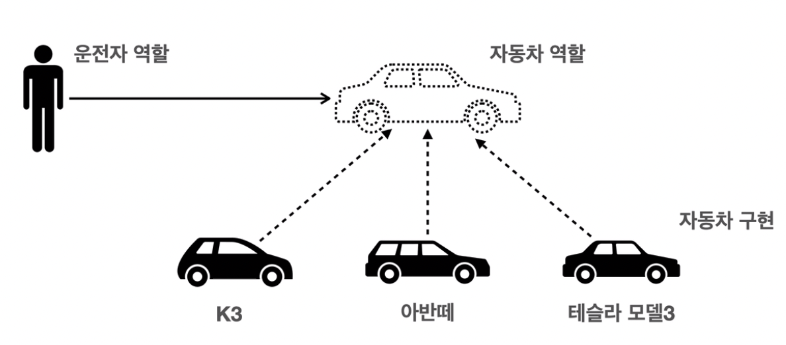
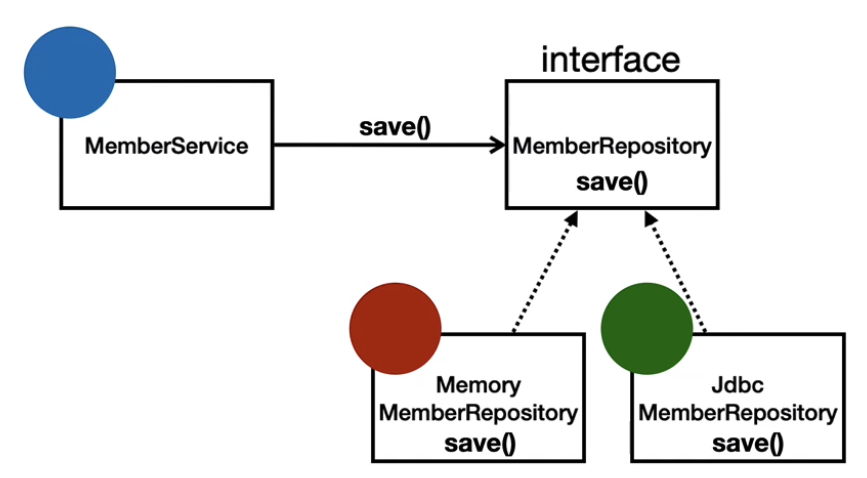

## 1. 스프링이란?

### 스프링의 생태계

> **필수:**
> 스프링 프레임워크, 스프링 부트

**선택:**
스프링 데이터, 스프링 세션, 스프링 시큐리티, 스프링 Rest Docs, 스프링 배치, 스프링 클라우드

>

### 가장 중요한 것: **스프링 프레임워크**

- **핵심 기술:** 스프링 DI 컨테이너, AOP, 이벤트, 기타
- **웹 기술:** 스프링 MVC, 스프링 webFlux
- **데이터 접근 기술:** 트랜잭션, JDBC, ORM 지원, XML 지원
- **기술 통합:** 캐시, 이메일, 원격접근, 스케줄링
- **테스트:** 스프링 기반 테스트 지원
- **언어:** 코틀린, 그루비

> \*최근에는 **스프링 부트**를 통해서 스프링 프레임워크의 기술들을 편리하게 사용한다.

**\*스프링 부트:**

- 스프링을 편리하게 사용할 수 있도록 지원, 최근에는 기본으로 사용
- 단독으로 실행할 수 있는 스프링 애플리케이션을 쉽게 생성
- Tomcat 같은 웹 서버를 내장해서 별도의 웹 서버를 설치하지 않아도 됨
- 손쉬운 빌드 구성을 위한 starter 종속성 제공
- 스프링과 3rd party(외부) 라이브러리 자동 구성
- 메트릭, 상태 확인, 외부 구성 같은 프로덕션 준비 기능 제공
- 관례에 의한 간결한 설정
- 스프링 부트는 스프링 프레임워크를 기반으로 나머지 외부 라이브러리를 자동으로 구성해주는 기술이지, 자체적으로 사용할 수 있는 것이 아님

### 스프링의 의미

- 스프링이라는 단어는 문맥에 따라 다르게 사용된다.
  1. 스프링 DI 컨테이너 기술
  2. 스프링 프레임워크
  3. 스프링 부트, 스프링 프레임워크 등을 모두 포함한 스프링 생태계

### 스프링의 핵심 개념

- 자바 언어 기반의 프레임워크
- 자바 언어의 가장 큰 특징 - **객체 지향 언어**
- 스프링은 객체 지향 언어가 가진 강력한 특징을 살려내는 프레임워크
- 스프링은 **좋은 객체 지향** 애플리케이션을 개발할 수 있게 도와주는 프레임워크
- **객체 지향 프로그래밍**은 스프링의 근원

## 2. 좋은 객체 지향 프로그래밍이란?

### 객체 지향 프로그래밍이란?

- 프로그램을 명령어의 목록으로 보는 시각에서 벗어나 여러개의 독립된 단위,
  즉 “**객체**"들의 **모임**으로 파악하고자 하는 것이다.
  각각의 **객체**는 **메세지**를 주고받고 데이터를 처리한다. **(협력)**
- 객체 지향 프로그래밍은 프로그램을 **유연**하고 **변경이 용이**하게 만들기 때문에 대규모 소프트웨어 개발에 많이 사용된다.

> **유연하고 변경이 용이?**
>
> 1. 레고 블럭 조립하듯이
> 2. 키보드, 마우스 갈아 끼우듯이
> 3. 컴퓨터 부품 갈아 끼우듯이
> 4. 컴포넌트를 쉽고 유연하게 변경하면서 개발할 수 있는 방법

### 객체 지향의 특징

- 추상화
- 캡슐화
- 상속
- **다형성** → 유연하고 변경이 용이하도록 하는데에 크게 기여함

### 다형성의 실세계 비유

- 실세계와 객체 지향이 1:1로 매칭되지는 않음
- 그러나 실세계의 비유로 이해하기 편리함
- **역할**과 **구현**으로 세상을 구분

**운전자 - 자동차 예시**



- 자동차의 역할(인터페이스)을 3개의 자동차로 구현함
- 운전자는 K3를 타다가 아반떼로 차를 변경할 수 있음
- 차가 바뀌어도 운전자는 운전을 할 수 있음 → 유연하고 변경이 용이
- **클라이언트에 영향을 주지 않고, 새로운 기능을 제공할 수 있음** → 유연하고 변경이 용이

> **이외의 예시**
>
> 공연에서 각 인물의 역할
> 키보드, 마우스, 세상의 표준 인터페이스들
> 정렬 알고리즘
> 할인 정책 예시

### 역할과 구현을 분리

- **역할과 구현**으로 구분하면 세상이 단순해지고 유연해지며, 변경도 편리해진다.
- 장점
  - 클라이언트는 대상의 **역할(인터페이스)만 알면 된다.**
  - 클라이언트는 구현 **대상의 내부 구조를 몰라도 된다.**
  - 클라이언트는 구현 **대상의 내부 구조가 변경되어도 영향을 받지 않는다.**
  - 클라이언트는 구현 **대상 자체를 변경해도 영향을 받지 않는다.**

### **자바 언어에서의 역할과 구현**

- 자바 언어의 다형성을 활용
  - 역할: 인터페이스
  - 구현: 인터페이스를 구현한 클래스, 구현 객체
- 객체를 설계할 때 **역할**과 **구현**을 명확히 분리
- 객체 설계시 역할(인터페이스)을 먼저 부여하고, 그 역할을 수행하는 구현 객체 만들기
  (구현보다 **역할이 중요**하다.)

### 객체의 협력이라는 관계부터 생각

- 혼자있는 객체는 없다.
- 클라이언트: 요청
- 서버: 응답
- 수 많은 객체 클라이언트와 객체 서버는 서로 협력 관계를 가진다.

### 자바 언어의 다형성



- 오버라이딩을 떠올려보자
- 오버라이딩된 메서드가 실행
- 다형성으로 인터페이스를 구현한 객체를 실행 시점에 유연하게 변경할 수 있다.
- 물론 상속 관계도 다형성, 오버라이딩 적용 가능

```java
public class MemberService {
	private MemberRepository memberRepository1 = new MemoryMemberRepository();
	private MemberRepository memberRepository2 = new JdbcMemberRepository();
}
```

### 다형성의 본질

- 인터페이스를 구현한 **객체 인스턴스**를 **실행 시점에 유연하게** 변경할 수 있다.
- 다형성의 본질을 이해하려면 **협력**이라는 객체 사이의 관계에서 시작해야함
- **클라이언트를 변경하지 않고, 서버의 구현 기능을 유연하게 변경할 수 있다.**

### 역할과 구현을 분리 - 정리

- 실세계의 역할과 구현이라는 편리한 컨셉을 다형성을 통해 객체 세상으로 가져올 수 있음
- 유연하고, 변경이 용이
- 확장 가능한 설계
- 클라이언트에 영향을 주지 않는 변경 가능
- 인터페이스를 안정적으로 잘 설계하는 것이 중요

### 역할과 구현을 분리 - 한계

- 역할(인터페이스) 자체가 변하면 클라이언트, 서버 모두에 큰 변경이 발생한다.
- 자동차를 비행기로 변경해야 한다면?
- 대본 자체가 변경된다면?
- USB 인터페이스 자체가 변경된다면?
- 인터페이스를 안정적으로 잘 설계하는 것이 중요

### 스프링과 객체 지향

- 다형성이 가장 중요하다!
- 스프링은 다형성을 극대화해서 이용할 수 있게 도와준다.
- 스프링에서 이야기하는 제어의 역전(IoC), 의존관계 주입(DI)은 다형성을 활용해서 역할과 구현을 편리하게 다룰 수 있도록 지원한다.
- 스프링을 사용하면 마치 레고 블럭 조립하듯이, 공연 무대의 배우를 선택하듯이, 구현을 편리하게 변경할 수 있다.
- 그리고 또 중요한 것 - **SOLID**

## 3. 좋은 객체 지향 설계의 5가지 원칙 (SOLID)

### SOLID

클린코드로 유명한 로버트 마틴이 좋은 객체 지향 설계의 5가지 원칙을 정리

- **SRP:** 단일 책임 원칙 (Single Responsibility Principle)
- **OCP:** 개방 - 폐쇄 원칙 (Open - Closed Principle)
- **LSP:** 리스코프 치환 원칙 (Liskov Substitution Principle)
- **ISP:** 인터페이스 분리 원칙 (Interface Segregation Principle)
- **DIP:** 의존관계 역전 원칙 (Dependency Inversion Principle)

### **SRP:** 단일 책임 원칙 (Single Responsibility Principle)

- 한 클래스는 하나의 책임만 가져야 한다.
- 하나의 책임이라는 것은 모호하다.
  - 클 수 있고, 작을 수 있다.
  - 문맥과 상황에 따라 다르다.
- 중요한 **기준은 변경**이다.
  - 변경이 있을 때 파급효과가 적으면 단일 책임 원칙을 잘 따른 것
  - Ex) UI 변경, 객체의 생성과 사용을 분리

### **OCP:** 개방 - 폐쇄 원칙 (Open - Closed Principle)

- 가장 중요한 원칙
- 소프트웨어 요소는 **확장에는 열려**있으나 **변경에는 닫혀**있어야 한다.
- 다형성을 활용
  - 인터페이스를 구현한 클래스를 하나 만들어서 새로운 기능을 구현
  - 지금까지 배운 역할과 구현의 분리를 생각해보자
  - Ex) 운전자 - 자동차
    - 자동차가 바뀌어도 운전자는 똑같이 운전함 → 확장에 열림
- 문제점
  - MemberService 클라이언트가 구현 클래스를 직접 선택
  ```java
  public class MemberService {
  	// 기존 코드
  	// private MemberRepository memberRepository1 = new MemoryMemberRepository();
  	// 변경 코드
  	private MemberRepository memberRepository2 = new JdbcMemberRepository();
  }
  ```
  - **구현 객체를 변경하려면 클라이언트 코드를 변경해야 한다.**
  - **다형성을 사용했지만 OCP 원칙을 지킬 수 없다.**
  - 객체를 생성하고, 연관관계를 맺어주는 별도의 조립, 설정자가 필요하다.
    - 이 역할을 스프링 컨테이너가 해결해줌

### **LSP:** 리스코프 치환 원칙 (Liskov Substitution Principle)

- 프로그램의 객체는 프로그램의 정확성을 깨뜨리지 않으면서 하위 타입의 인스턴스를 바꿀 수 있어야 한다.
- 다형성에서 하위 클래스는 인터페이스 규약을 다 지켜야 한다는 것
  - 다형성을 지원하기 위한 원칙
  - 인터페이스를 구현한 구현체를 믿고 사용하려면 이 원칙이 필요하다.
- 단순히 컴파일에 성공하는 것을 넘어서는 이야기
- Ex) 자동차 인터페이스의 엑셀은 앞으로 가라는 기능 → 뒤로가게 구현하면 리스코프 치환 원칙 위반

### **ISP:** 인터페이스 분리 원칙 (Interface Segregation Principle)

- 특정 클라이언트를 위한 인터페이스 여러 개가 범용 인터페이스 하나보다 낫다.
- 자동차 인터페이스 → 운전 인터페이스, 정비 인터페이스로 분리
- 사용자 클라이언트 → 운전자 클라이언트, 정비사 클라이언트로 분리
- 분리하면 정비 인터페이스 자체가 변해도 운전자 클라이언트에 영향을 주지 않음
- 인터페이스가 명확해지고, 대체 가능성이 높아진다.

### **DIP:** 의존관계 역전 원칙 (Dependency Inversion Principle)

- “추상화에 의존해야지, 구체화에 의존하면 안된다.”
  - 이 원칙을 따르는 방법 중 하나다.
- 쉽게 이야기 해서 구현 클래스에 의존하지 말고, 인터페이스에 의존하라는 뜻
- 앞에서 이야기한 **역할에 의존하게 해야 한다**는 것과 같다.
  - 객체 세상도 클라이언트가 인터페이스에 의존해야 유연하게 구현체를 변경할 수 있다.
  - 구현체에 의존하게 되면 변경이 아주 어려워진다.
- Ex) 운전자 - 자동차
  - 운전자는 운전 역할에 의존해야지, 자동차 종류에 의존할 경우 차량이 바뀌면 운전이 어려워짐
- 그런데 개방 - 폐쇄 원칙에서 설명한 MemberService는 인터페이스에 의존하지만, 구현 클래스도 동시에 의존한다.
  - MemberService가 구현 클래스를 직접 선택 → **DIP 위반**

### 정리

- 객체 지향의 핵심은 다형성
- 다형성만으로는 쉽게 부품을 갈아 끼우듯이 개발할 수 없다.
- 다형성만으로는 구현 객체를 변경할 때 클라이언트 코드도 함께 변경된다.
- **다형성만으로는 개방 - 폐쇄 원칙, 의존관계 역전 원칙을 지킬 수 없다.**

## 4. 객체 지향 설계와 스프링

### 왜 스프링 이야기에 객체 지향이야기가 나오는가?

- 스프링은 다음 기술로 다형성 + 개방 - 폐쇄 원칙, 의존관계 역전 원칙을 가능하게 지원한다.
  - DI (Dependency Injection): 의존관계, 의존성 주입
  - DI 컨테이너 제공
- 클라이언트 코드의 변경 없이 기능 확장
- 쉽게 부품을 교체하듯이 개발

### 총 정리

- 모든 설계에 역할과 구현을 분리하자
- 자동차, 공연의 예를 떠올려보자
- 애플리케이션 설계도 공연을 설계하듯이 배역만 만들어두고, 배우는 언제든지 **유연하게 변경**할 수 있도록 만드는 것이 좋은 객체 지향 설계이다.
- 이상적으로는 모든 설계에 인터페이스를 부여하자.

### 실무 고민

- 하지만 인터페이스를 도입하면 추상화라는 비용이 발생한다.
  - 인터페이스도 만들고 구현체도 만들고
  - 개발자가 구현된 코드가 안보여서 한 번더 열어봐야 됨
- 기능을 확장할 가능성이 없다면 구체 클래스를 직접 사용하고, 향후에 꼭 필요할 때 리팩토링을 해서 인터페이스를 도입하는 것도 방법이다.

## Reference

- [인프런 강의 스프링 핵심 원리(김영한)](https://www.inflearn.com/course/%EC%8A%A4%ED%94%84%EB%A7%81-%ED%95%B5%EC%8B%AC-%EC%9B%90%EB%A6%AC-%EA%B8%B0%EB%B3%B8%ED%8E%B8)
